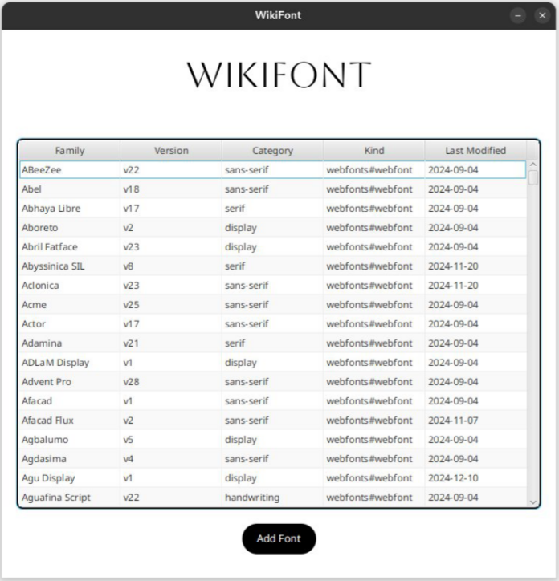
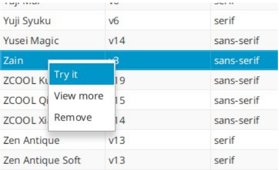
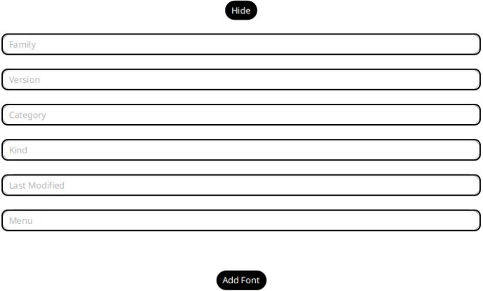
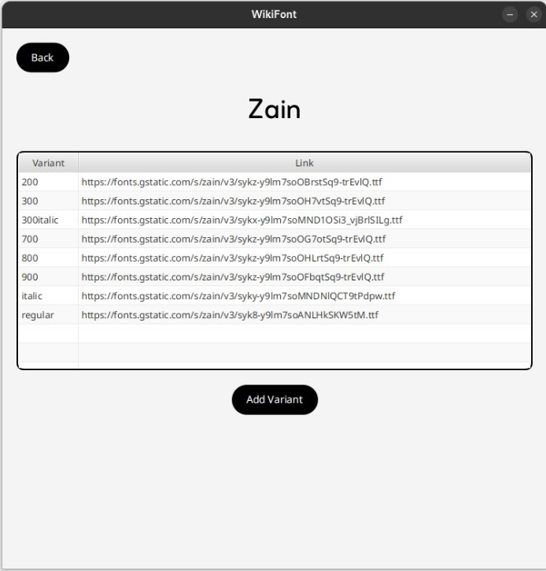
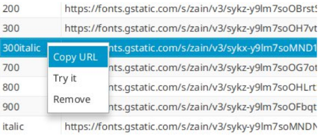

# Wikifont

Original text in 🇮🇹 [Italiano](docs/README.it.md)

## Table of Contents

1 Introduction  
2 Application  
2.1. Font selection interface  
2.2. Variant selection interface  
3 Implementation details  
3.1. Server endpoints  
3.2. Database  
3.3. Data loading quantity  
3.4. Communication between application, server and database  
3.5. Unit tests

## 1 Introduction

Wikifont is a service designed to help users choose fonts for their personal projects. Upon first activation, it includes fonts available from the Google Font API, but users can add and remove their own fonts and variants to create their personal collection of favorite fonts. Within the application, users can also see the appearance of fonts and their variants, and copy the URL to incorporate them into their own projects.

## 2 The Application

The application has a minimalist and elegant design, intended to make the user feel as if they were in a typography studio. In the first interface, as per specifications, a **Load Data** button has been added, but for a simpler and cleaner interface, it's possible to set the "caricamento" variable to true in the FontController class, and the data will be loaded automatically by the application. Let's now analyze all the features introduced in each interface:

**2.1 Font selection interface**



In this interface, users can browse through all fonts, viewing information such as: family, version, category, type, and the date of the last modification made to that version.
Once a font is selected, right-clicking allows access to the following functions:



- **Try it:** Shows the appearance of the font in the interface. This feature is implemented using the "menu" attribute of the Font object associated with that table row, which represents a link to a menu version of the font, containing only the necessary data to display the font name in the font itself.
- **View more:** Takes you to the next interface where you can view and choose a variant of the selected font.
- **Remove:** Removes the font and all its associated variants from both the table and the database.

Clicking on **Add Font** displays the following form:



Once filled out, pressing the new **add font** button adds the font to both the table, so it can be immediately displayed, and to the database to ensure persistence. If any field in the form is left empty, the interface will notify the user and will not update the system. Pressing the **Hide** button hides the form and allows continued normal use of the interface.

**2.2 Variant selection interface**



In this interface, once a variant is selected, right-clicking provides access to the following features:



- **Copy URL:** Allows the user to copy the link in order to easily incorporate the font into their project.
- **Try it:** Displays the font variant, to simplify the selection process.
- **Remove:** Removes a variant from both the table and the database.

Clicking **Add variant** displays this form:


This form works exactly like the one in the font selection interface, with the difference that instead of adding a font, it allows adding a variant to the previously selected font, both to the table and to the database. As in the previous interface, if any text field is empty when clicking the **Add Variant** button, the request to add the variant will not proceed, and the user will be notified to fill in the corresponding field. Pressing **Hide** hides the form. To return to the font selection screen, use the **Back** button.

## 3 Implementation details

**3.1 Server endpoints**

The server, with base path **/font**, provides the following endpoints:

- **GET /all** Returns all fonts contained in the "font" table of the database.
- **GET /caricadati** Returns the same result as /all, but if the database is empty, it loads data from the Google fonts API.
- **POST /deletefont** Allows deleting from the database both the font and its variants that are passed in the request body in JSON format. Returns "done" if there are no errors.
- **POST /deletevariant** Allows deleting from the database the variant that is passed in JSON format. Returns "done" if there are no errors.
- **POST /variants** Returns all variants in JSON format of a font family that is passed as a parameter "family=" in the request.
- **POST /addfont** Adds to the database the font that is passed in JSON format in the request body. Returns "done" if there are no errors.
- **POST /addvariant** Adds to the database the variant that is passed in the request body in JSON format. Returns "error" if the font to which the variant belongs does not exist, otherwise, if there are no errors, returns "done".

**3.2 Database**

The database consists of two tables:

- **font:** Contains details about font families
- **variants:** Contains the variants of each font family with their respective download links

Here is the database structure in DDL:

```
CREATE TABLE `font` (
`family` varchar(255) NOT NULL,
`category` varchar(255) DEFAULT NULL,
`kind` varchar(255) DEFAULT NULL,
`lastmodified` date DEFAULT NULL,
`menu` varchar(350) DEFAULT NULL,
`version` varchar(255) DEFAULT NULL,
PRIMARY KEY (`family`)
) ENGINE=InnoDB


CREATE TABLE `variants` (
`variant` varchar(255) NOT NULL,
`link` varchar(350) DEFAULT NULL,
`family` varchar(255) NOT NULL,
PRIMARY KEY (`family`,`variant`),
CONSTRAINT `FK3ddamcte27pn7iw0bptyl5b08` FOREIGN KEY (`family`)
REFERENCES `font` (`family`)
) ENGINE=InnoDB
```

**3.3 Data loading quantity**

Within the "MainController" class, the constant "MAXDB" has been defined with a default value of 200, with the purpose of limiting the amount of data downloaded from the Google API during loading. If you wish to download the entire amount of data that Google makes available, you can do so by setting the variable to 1800. The system is fully functional even with all 1798 fonts and 6764 variants made available by the external API, but in order to reduce database population time, it is advisable to leave it at 200.

**3.4 Communication between application, server and database**

**Communication between Client and Server**
The application interacts with the service through the HttpURLConnection class, which allows sending HTTP requests. The communication between client and server occurs in JSON format through two classes, one for variants and one for fonts, which have the following structure:
```
public class Font implements
Serializable{
    public String family;
    public String version;
    public String lastModified;
    public String category;
    public String kind;
    public String menu;
/*
* Constructors, getters and setters
*/
}
```
```
public class Variants implements
Serializable{
    public String family;
    public String variant;
    public String link;
/*
* Constructors, getters and setters
*/
}
```

**Communication between Server and Database**
The communication between server and database occurs through Java Persistence API using two classes: one for fonts and one for variants. The class dedicated to fonts is almost identical to the one used for communication with the client, apart from the annotations necessary for JPA, the only difference is the attribute "lastModified" which is of type "Date" instead of "String". If you look at the "VariantsDB" class, used to communicate with the "variants" table of the database, the differences increase: JPA requires a class annotated with "@Embeddable" that represents the composite primary key and also a "Font" object to create the foreign key constraint with the "font" table. Therefore, I preferred to simplify communication with the client by creating another class for Client-Server communication, but imposing on the server the task of transforming the database response ("VariantsDB") into the class suitable for communication with the client ("Variants").

**3.5 Unit Tests**

The unit test was implemented on the server and consists of four tests:

- **getAllFont():** Checks that the server responds correctly to /all.
- **getData():** Checks that the server responds correctly to /caricadati.
- **equalsData():** Checks that the responses to /all and /caricadati are the same.
- **tryAddDeleteNewFont():** Performs these tests in order:
    - Testing the addition of a font
    - Testing the addition of a variant to the previously loaded font
    - Testing the persistence of the newly added variant
    - Testing the removal of the newly added variant
    - Testing the removal of the newly added font

---

*This document was automatically translated from Italian to English by AI on May 11, 2025.*
