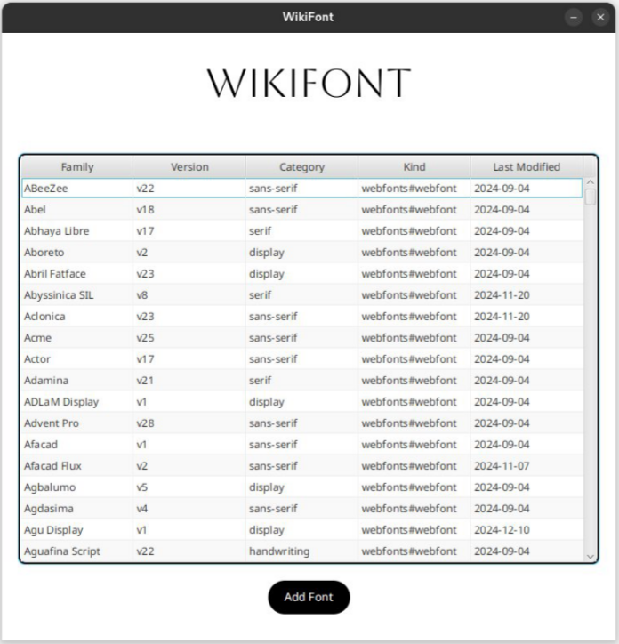
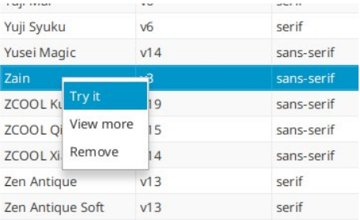
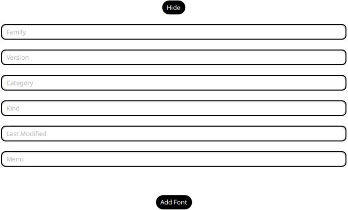
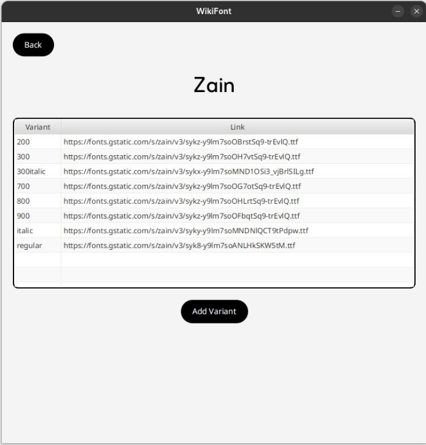
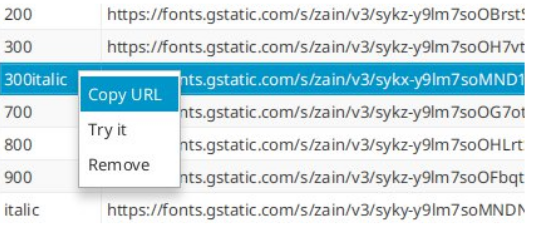
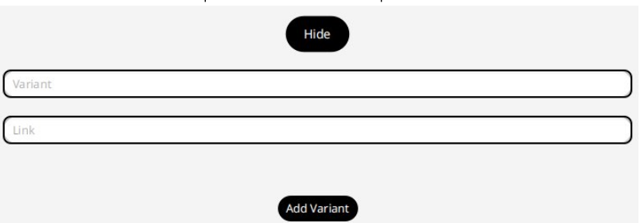

# Wikifont
## Indice

1 Presentazione \
2 Applicazione \
2.1. Interfaccia dedicata alla scelta del font \
2.2. Interfaccia dedicata alla scelta della variante \
3 Dettagli implementativi \
3.1. Endpoint resi disponibili dal server \
3.2. Database \
3.3. Quantità di dati per il popolamento \
3.4. Comunicazione tra applicazione, server
e database \
3.5. Unit test

## 1 Presentazione

Wikifont è un servizio che nasce con l’intento di facilitare la scelta dei font in
progetti personali degli utenti. Alla sua prima attivazione è composto dai font
disponibili dall’API di Google font, ma l’utente ha la possibilità di aggiungere e
rimuovere i suoi font e le sue varianti, in modo da creare la propria collezione di
font preferiti. All’interno dell’applicazione è possibile anche vedere l’aspetto dei
font e delle varianti, e copiarne l’URL per incorporarlo nei propri progetti.

## 2 L’applicazione

L'applicazione ha una grafica minimalista ed elegante, pensata per far sentire
l'utente come se fosse in una tipografia. Nella prima interfaccia, come da
specifiche, è stata aggiunto il pulsante **Carica dati** , ma per avere un’interfaccia
più semplice e più pulita è possibile settare a true la variabile “caricamento”
all’interno della classe FontController e i dati verranno caricati automaticamente
dall’applicazione. Analizziamo adesso tutte le funzionalità introdotte interfaccia
per interfaccia:


**2.1 Interfaccia dedicata alla scelta del font**




In questa interfaccia è possibile sfogliare tutti i font, dei quali si può visualizzare:
la famiglia, la versione, la categoria, la tipologia e l’ultima modifica apportata a
tale versione.
Una volta selezionato un font, premendo il tasto destro è possibile accedere alle
seguenti funzioni:



- **Try it:** Permette di mostrare l’aspetto del font nell’interfaccia. Funzione
    implementata mediante l’attributo “menu” dell’oggetto Font associato a
    quella riga della tabella, che rappresenta un link ad una versione menu del
    font,checontieneisolidatinecessariamostrareilnomedelfontconilfont
    stesso.
- **View more:** Passa all’interfaccia successiva in cui è possibile visualizzare e
    scegliere una variante del font selezionato.
- **Remove:** Rimuove il font e tutte le varianti a lui collegate dalla tabella e dal
    database.
Premendo su **Add Font** è possibile visualizzare il seguente form:



Una volta riempito premendo il nuovo pulsante **add font** è possibile aggiungere
il font sia alla tabella, in modo da visualizzarlo subito, sia al database per
garantirne la persistenza. Se uno dei campi del form non è stato riempito,


l’interfaccia lo segnalerà all’utente e non aggiornerà il sistema. Premendo il
pulsante **Hide** è possibile rimuovere il form e continuare con il normale utilizzo
dell’interfaccia.

**2.2 Interfaccia dedicata alla scelta della variante**



In questa interfaccia, una volta selezionata una variante, con il tasto destro è
possibile accedere alle seguenti funzionalità:



- **Copy URL:** Permette all’utente di copiare il link in modo da poter
    facilmente incorporare il font nel suo progetto.
- **Try it:** Permette di visualizzare la variante del font, in modo da semplificare
    la scelta.
- **Remove:** Permette di rimuovere una variante sia dalla tabella che dal
    database.
Premendo **Add variant** è possibile visualizzare questo form: 



Questo form funziona esattamente come quello dell’interfaccia per la scelta del
font, con la differenza che invece di aggiungere un font permette di aggiungere
sia alla tabella che al database, una variante al font precedentemente
selezionato. Anche in questo caso, come nell’interfaccia precedente, se uno dei
campi di testo risultasse vuoto al momento del click del pulsante **Add Variant,** la
richiesta di aggiunta della variante non avrà luogo e verrà segnalato all’utente di
riempireilcampocorrispondente.Premendo **Hide** èpossibilenascondereilform.
Se invece si vuole tornare alla schermata di scelta di un font ciò è possibile
attraverso il pulsante **Back**.


## 3 Dettagli implementativi

**3.1 Endpoint resi disponibili dal server**

Il server, con percorso base **/font** , mette a disposizione i seguenti endpoint:

- **GET /all** Restituisce tutti i font contenuti nella tabella “font” del database.
- **GET /caricadati** Restituisce lo stesso risultato di /all, ma se il database è
    vuoto carica i dati dalla API di Google font.
- **POST /deletefont** Permette di eliminare dal database le varianti del font e
    ilfontchevienepassatonelbodydellarichiestainformatojson.Restituisce
    “done” se non ci sono stati errori.
- **POST /deletevariant** Permette di eliminare dal database la variante che
    gli viene passata in formato json. Restituisce “done” se non ci sono stati
    errori.
- **POST /variants** Restituisce tutte le varianti in formato json di una famiglia
    di font che viene passata come parametro “family=” nella richiesta.
- **POST /addfont** Aggiunge al database il font che gli viene passato in
    formatojsonnelbodydellarichiesta.Restituisce“done”senoncisonostati
    errori.
- **POST /addvariant** Aggiunge al database la variante che gli viene passata
    nel body della richiesta in formato json. Restituisce “error” se non esiste il
    font a cui appartiene la variante altrimenti, se non ci sono stati errori,
    restituisce “done”.

**3.2 Database**

Il database è formato da due tabelle:

- **font:** Contiene i dettagli riguardanti le famiglie di font
- **variants:** Contiene le varianti di ogni famiglia di font con i rispettivi link per
    il download

Qui sotto riporto la struttura del database in DDL:

```
CREATE TABLE `font` (
`family` varchar(255) NOT NULL,
`category` varchar(255) DEFAULT NULL,
`kind` varchar(255) DEFAULT NULL,
`lastmodified` date DEFAULT NULL,
`menu` varchar(350) DEFAULT NULL,
`version` varchar(255) DEFAULT NULL,
PRIMARY KEY (`family`)
) ENGINE=InnoDB


CREATE TABLE `variants` (
`variant` varchar(255) NOT NULL,
`link` varchar(350) DEFAULT NULL,
`family` varchar(255) NOT NULL,
PRIMARY KEY (`family`,`variant`),
CONSTRAINT `FK3ddamcte27pn7iw0bptyl5b08` FOREIGN KEY (`family`)
REFERENCES `font` (`family`)
) ENGINE=InnoDB
```

**3.3 Quantità di dati per il popolamento**

All’interno della classe “MainController” è stata definita la costante “MAXDB” con
valoredidefaulta200,conloscopodilimitareduranteilcaricamentolaquantità
di dati che viene scaricata dalla API di Google. Se si desidera scaricare l’intero
ammontare dei dati che Google rende disponibile è possibile farlo settando la
variabile a 1800. Il sistema è pienamente funzionante anche con tutti i 1798 font
e le 6764 varianti messe a disposizione dalla API esterna, ma al fine di ridurre i
tempi di popolamento del database è consigliabile lasciarla a 200.

**3.4 Comunicazione tra applicazione, server e database**

**Comunicazione tra Client e Server**
L’applicazione interagisce con il servizio attraverso la classe HttpURLConnection,
che permette di inviare richieste http. La comunicazione tra cliente e server
avviene in formato json attraverso due classi, una per le varianti e una per i font,
che hanno la seguente struttura:
```
public class Font implements
Serializable{
    public String family;
    public String version;
    public String lastModified;
    public String category;
    public String kind;
    public String menu;
/*
* Costruttori, getter e setter
*/
}
```
```
public class Variants implements
Serializable{
    public String family;
    public String variant;
    public String link;
/*
* Costruttori, getter e setter
*/
}
```

**Comunicazione tra Server e Database**
La comunicazione tra server e database avviene attraverso Java Persistence API
mediante l’utilizzo di due classi: una per i font e una per le varianti. La classe
dedicata ai font è quasi identica a quella utilizzata per la comunicazione con il
client, tralasciando le annotazioni necessarie per JPA l’unica differenza è
l’attributo“lastModified” èditipo“Date”inveceche“String”.Sesiguardalaclasse
“VariantsDB”, utilizzata per comunicare con la tabella “variants” del database le
differenze aumentano: JPA richiede una classe annotata come “@Embeddable”
che rappresenta la chiave primaria composta e anche un oggetto “Font” per
creare il vincolo di chiave esterna con la tabella “font”. Perciò ho preferito
semplificare la comunicazione con il client creando un’altra classe per la
comunicazioneClient-Server,imponendoperòalserverilcompitoditrasformare
la risposta del database (“VariantsDB”) nella classe adatta alla comunicazione
con il client (“Variants”).

**3.5 Unit Test**

Lo unit test è stato implementato sul server ed è composto da quattro test:

- **getAllFont():** Controlla che il server risponda correttamente a /all.
- **getData():** Controlla che il server risponda correttamente a /caricadati.
- **equalsData():** Controlla che le risposte ad /all e /caricadati siano uguali.
- **tryAddDeleteNewFont():** Fa in ordine questi test:
    ◦ Test di aggiunta di un font
    ◦ Test di aggiunta di una variante al font precedentemente caricato
    ◦ Test di persistenza della variante appena aggiunta
    ◦ Test di rimozione della variante appena aggiunta
    ◦ Test di rimozione del font appena aggiunto


